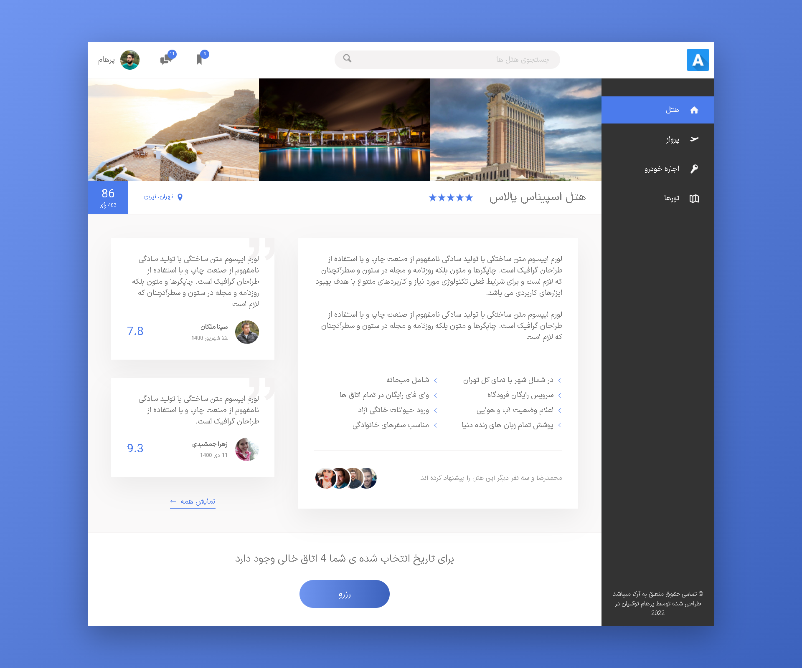
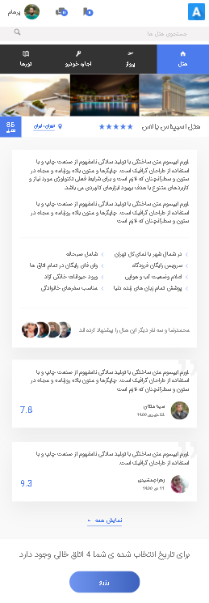

# Arka Web Application User-Interface - html, css, scss
User Interface for Arka web application (hotel and plane reservation) and only made with Flex Box and 100% Responsive

## Table of contents

- [Overview](#overview)
  - [The challenge](#the-challenge)
  - [Links](#links)
- [My process](#my-process)
  - [Built with](#built-with)
- [Author](#author)
- [Usage](#usage)
- [Screenshot](#screenshot)

## Overview

### The challenge

Users should be able to see:

- user menu when hovering over the username
- A message menu when hovering over 
- images with nice hover effect
- box with search suggestions as soon as the user starts typing in the search field

### Links

- Live Site URL: [GitHub Pages](https://frontendparham.github.io/Arka/)
- Live Site URL: [Netlify](https://arka.netlify.app/)

## My process

### Built with

- Flex-Box
- HTML
- CSS
- SASS
- Responsive Design

## Author

- Parham Tavakolian
- Instagram - [@frontendparham](https://www.instagram.com/frontendparham)
- Instagram - [@ecofrontend](https://www.instagram.com/ecofrontend)
- GitHub - [@frontendparham](https://www.github.com/frontendparham)

## Usage

```
# Install dependencies
npm install

# Watch CSS & run live server
npm run start

# Build CSS and assets
npm run build:css
```

## Screenshot


